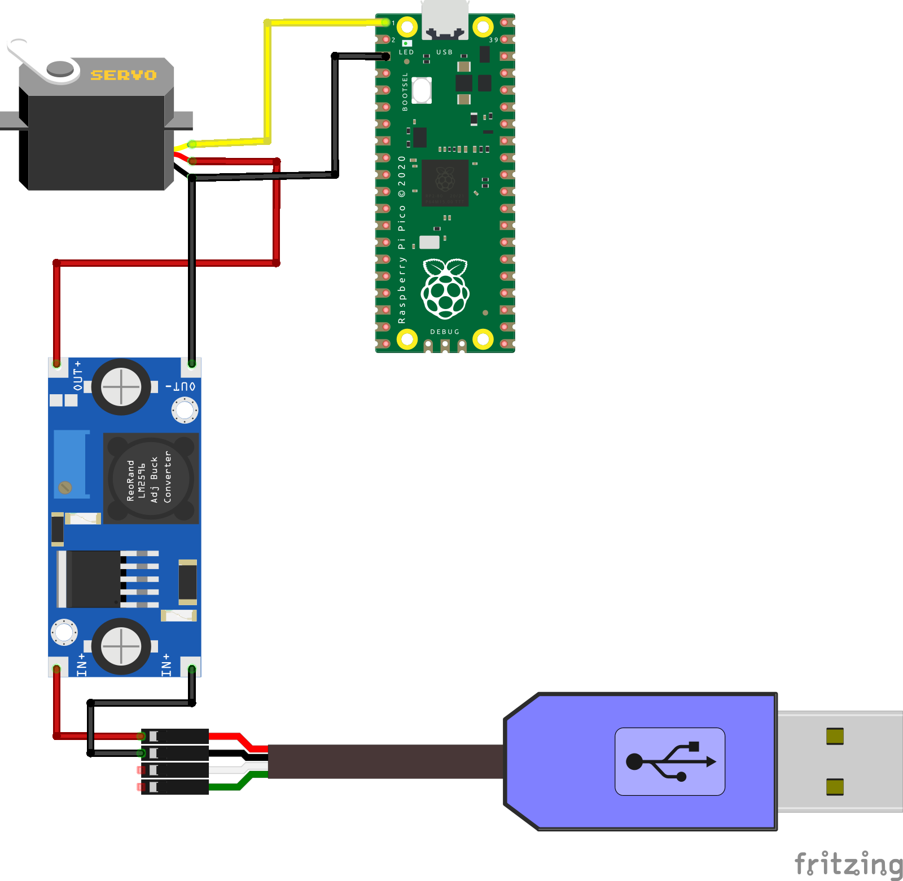

# Control Servo Motors with Raspberry Pi Pico

Welcome to the "Control Servo Motors with Raspberry Pi Pico" 
repository!

You can find the full tutorial [here]()
- how to build your device
- code explanation
- how to setup your Raspberry Pi Pico

