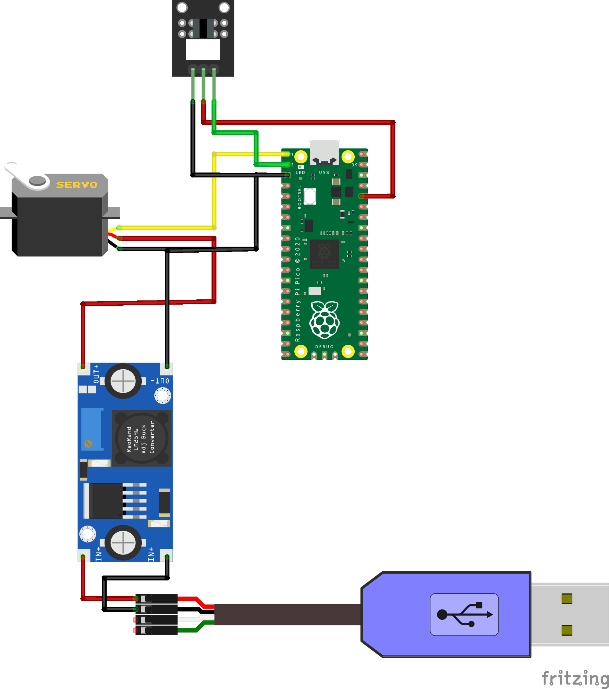

# Control Servo Motors with Raspberry Pi Pico

Welcome to the "Control Servo Motors with Raspberry Pi Pico" 
repository!

You can find the full tutorial [here](https://diy-home.org/2023/03/13/control-servo-motors-with-python-and-micropython/)
- how to build your device
- code explanation
- how to setup your Raspberry Pi Pico

